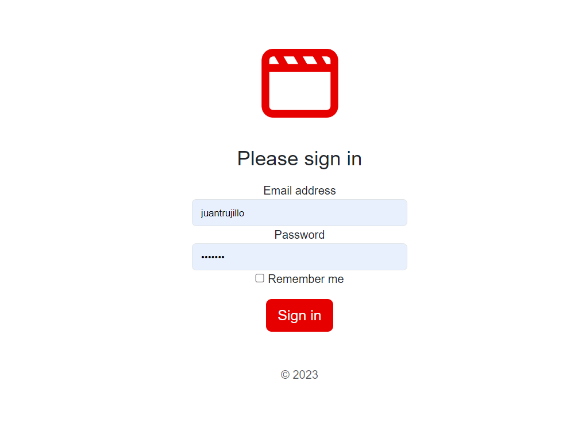

# alternova

Test made for ALTERNOVA

---

# Requirements

Some of the main requirements to execute the whole test are:

* Python 3.10
* Django 4.19
* djangorestframework 3.14.0

The rest of the requirements can be reviewed on the text file called requirements.txt located on the base project path.

# Installation

The first thing to do is to clone the repository

```shell
$ git clone https://github.com/JuanTrujilloDev/alternova
$ cd alternova
```

Create a virtual virtual enviroment and activate it (In this case pip is being used).

```shell
$ virtualenv venv
$ source venv/bin/activate
```

Or in case you are using windows powershell

```powershell
$ python3 -m venv .
$ Scripts/Activate.ps1
```

Then install all the dependencies

```shell
(alternova)$ pip install -r requirements.txt
```

Please make sure that your virtual environment is activated. You can know if it is activated because **(venv)** is on front of the prompt.

Once **pip** has installed all the dependencies you can move to the project folder and create all the migrations and store the initial data.

```shell
(alternova)$ cd alternovafilms
(alternova)$ python manage.py makemigrations
(alternova)$ python manage.py migrate
```

Then you can see that all the initial migrations where made and that a sqlite file is created (due to sqlite being used on django settings). However you can change to any database by changing the settings located on **alternova/settings.py** and changing the values on **DATABASE** dict. 

Once all the migrations are done you can now create a super user in order to interact with the database.

```shell
(alternova)$ python manage.py createsuperuser
Username (leave blank to use 'pc-user'): 
Email address:
Password:
```

Now you can load dummy data with the fixtures created, to do that make sure the fixtures are located on **films/fixtures** it contains JSON files with the data. 

**NOTE: PLEASE MAKE SURE YOU LOAD THE DATA ON THE GIVEN ORDER.**

```shell
(alternova)$ python manage.py loaddata genres
(alternova)$ python manage.py loaddata film-types
(alternova)$ python manage.py loaddata films
(alternova)$ python manage.py loaddata ratings
```

Every time you load new data you should see a message like the given below.

```shell
Installed <number> objects(s) from <number> fixtures(s)
```

Finally you can run the server.

```shell
(alternova)$ python manage.py runserver
```

You should see the server running on your local machine

```shell
System check identified no issues (0 silenced).
May 07, 2023 - 22:20:42
Django version 4.1.9, using settings 'alternovafilms.settings'
Starting development server at http://127.0.0.1:8000/
Quit the server with CTRL-BREAK.
```

# Walkthrough

To interact with the application go to the given url on the terminal (it must be the one you configured as allowed host on settings.py). Once you open that url on a browser you should see the index of the page.


Now you can log-in to use any endpoint, for that go to /**accounts/login/**. There you can give the access data you have when creating the superuser.



Now that you logged in check each endpoint created, you can find all endpoints by going to **/docs/**. There you can read all the endpoints documentation made with swagger and test each endpoint, or you can go directly to all the endpoints to see the rendered HTML.


For example you can see the enpoint **/films/** tested on the next image, where you can see all the films and order them.


There you can see the response data containing all the films and pages (if you are not logged in you will receive the login page). In addition, you can see the endpoint rendered.


Now you can take the time to test the API by yourself, enjoy!

# Testing

TODO


# Notes

* To simplify installation it was decided to use sqlite, however a better aproach would be using PostgreSQL or any other DBMS.
* Views can be optimized by using async petitions with ajax and django async (but due to lack of time, wasn't implemented).
* Test can be implemented with more time.
